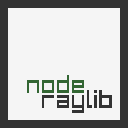

# node-raylib [](https://npmjs.org/package/raylib "View this project on npm") [](https://github.com/RobLoach/node-raylib/actions?query=workflow%3ATests+branch%3Amaster "See automated test status on GitHub Actions")

[Node.js](https://nodejs.org) bindings for [raylib](https://www.raylib.com/), a simple and easy-to-use library to enjoy videogames programming (www.raylib.com).

## Dependencies

- [Node.js](https://nodejs.org) >= 10
- [npm](https://www.npmjs.com)
- [cmake](https://cmake.org)

## Usage

1. Add `raylib` to your [package.json dependencies](https://docs.npmjs.com/files/package.json#dependencies):
    ``` bash
    npm init
    npm install raylib --save
    ```

2. Create a JavaScript file, like [`core_basic_window.js`](examples/core/core_basic_window.js):
    ``` javascript
    const r = require('raylib')

    const screenWidth = 800
    const screenHeight = 450
    r.InitWindow(screenWidth, screenHeight, "raylib [core] example - basic window")
    r.SetTargetFPS(60)

    while (!r.WindowShouldClose()) {
        r.BeginDrawing();
        r.ClearBackground(r.RAYWHITE)
        r.DrawText("Congrats! You created your first window!", 190, 200, 20, r.LIGHTGRAY)
        r.EndDrawing()
    }
    r.CloseWindow()        // Close window and OpenGL context
    ```

3. Run it through Node.js:
    ``` bash
    node core_basic_window.js
    ```

Check for more [examples](examples) organized by raylib modules.

## CLI

The project also comes with a [`node-raylib`](https://github.com/RobLoach/node-raylib/blob/master/bin/node-raylib) command-line tool to run `node-raylib` files directly:

``` bash
# Linux
./node-raylib core_basic_window.js

# Windows
node-raylib.exe core_basic_window.js
```

The CLI can be installed with the [packaged releases](https://github.com/RobLoach/node-raylib/releases), or globally through `npm`:

``` bash
npm install raylib --global
node-raylib --version
```

## Development

The following are a few notes and resources when developing `node-raylib`...

### Node.js Bindings

[node-addon-api](https://github.com/nodejs/node-addon-api) is used to construct the bindings. Feel free to read through [`src/addons.cc`](src/addons.cc) for an understanding on how methods are defined. A lot is missing from the project, so feel free to get involved in the issue queue and submit pull requests. Run the following to run tests...

```
npm it
```

### TypeScript Definitions

To rebuild [`index.d.ts`](index.d.ts), run the following commands:

```
npm i -g dts-gen yargs RobLoach/node-raylib
dts-gen -m raylib -f index.d.ts -o
```

### Package

To build the packaged releases, use the following command:

```
npm run pkg
```

## License

*node-raylib* is licensed under an unmodified zlib/libpng license, which is an OSI-certified,
BSD-like license that allows static linking with closed source software. Check [LICENSE](LICENSE) for further details.

*Copyright (c) 2018 Rob Loach ([@RobLoach](https://twitter.com/RobLoach))*
